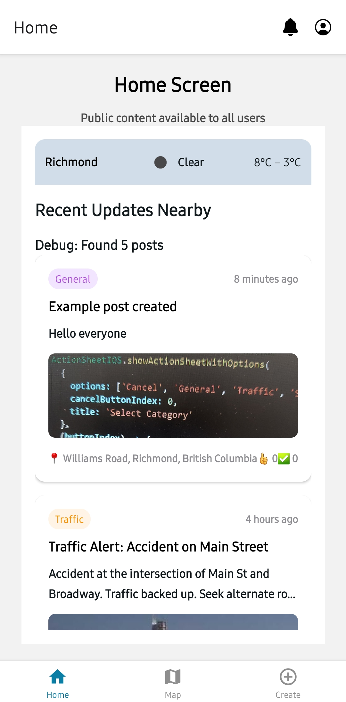

# CS5520-Final Project

## Team Members

Carlos Semeho Edorh

Yiyang Wang

## App Name

Local Buzz

## App Description

Stay instantly informed about what's happening right around you with Local Buzz! This hyperlocal community bulletin board app connects you with real-time events and incidents in your neighborhood. From traffic snarls and road closures to local festivals and community gatherings, Local Buzz keeps you in the loop. Share updates, photos, and alerts with your neighbors, fostering a stronger, more informed community. Our AI-powered categorization ensures you see the most relevant information quickly, and customizable notifications keep you informed without overwhelming you. Experience the power of real-time local connection – download Local Buzz today!

# Iteration 1 Submission

## Data Model and Collections

Our application uses three main collections in Firestore:

1. **Users Collection**

   - Stores user profile information and settings
   - Fields: username, email, photoURL, createdAt, lastLogin, notificationPreferences
   - CRUD Operations: Create (during signup), Read (profile view), Update (profile editing)

2. **Posts Collection**

   - Contains all posts shared in the app
   - Fields: title, content, category, locationName, location, authorId, authorName, photoURL, isPublic, likes, verified, createdAt
   - CRUD Operations: Create (post creation), Read (feed/detail view), Update (post editing), Delete (post removal)

3. **notificationPreferences Collection**
   - This is a subcolelction under users, which stores notification settings for users
   - Fields: categories, radius
   - CRUD Operations: Create (when new user sign up, empty), Read (when users try to edit), Update (with changed settings)

## Current Implementation Status

- Authentication with email/password is implemented with Firebase
- Users can register, log in, view and edit their profile information
- Public posts feed is available to all users, even when not logged in
- Post creation form is implemented with photo capture capability
- Location services integrated for capturing post location
- Weather information displayed using external OpenWeatherMap API
- Navigation structure implemented with tab navigation and stack navigation

## Screenshots

[Insert screenshots here]

- Screenshot 1: Authentication screens

|                  Login Screen                   |                  SignUp Screen                   |
| :---------------------------------------------: | :----------------------------------------------: |
|  |  |

- Screenshot 4: Profile screen

|                  Profile Screen                   |
| :-----------------------------------------------: |
|  |

- Screenshot 3: Post creation

|                  Post Creation                  |                  Post Details                   |
| :---------------------------------------------: | :---------------------------------------------: |
|  |  |

- Screenshot 2: Posts feed

|                    Post Page                    |                  Post Details                   |
| :---------------------------------------------: | :---------------------------------------------: |
|  |  |

# Team Member Contributions

## Carlos Semeho Edorh's Contributions:

- Implemented Firebase services and database structure
- Created public content components for displaying posts with weather integration
- Developed post detail page with dynamic routing
- Implemented post creation form with camera and location capture
- Added post interactions (like, verify, share functionalities)
- Integrated weather API for displaying local conditions
- Set up database initialization with sample data

### A breakdown of Carlos' contibutions

`[Firebase Services]`
I've implemented several service modules:

- PostService.ts handles creating, fetching, updating, and deleting posts
- UserService.ts manages user profiles and preferences
- DatabaseService.ts provides utilities for initializing and managing our database
- NotificationService.ts handles notification creation and management

`[Public Posts Components]`
For the public-facing part of our app, I built several components:

- PublicPostsList.tsx displays a feed of recent posts with weather integration
- PublicPostCard.tsx is a reusable component for displaying post information
- CompactWeather.tsx shows current weather conditions in a space-efficient format

`[public feed]`
Even without logging in, users can view posts and weather information. The weather data comes from OpenWeatherMap API, which I've created a component for, called CompactWeather.tsx integrated the API from the MyWeather.tsx my team mate created earlier which was a basic implementation of the API as a foundation for our weather feature integration.

`[Post Detail Page]`
I implemented dynamic routing for post details using Expo Router. When a user taps on a post, they're taken to this detail view where they can see the full content and interact with the post.

`[Post creation]`
For authenticated users, I created this post creation form. It captures:

- Title and content
- Category selection
- Current location (using Expo Location)
- Photos using the device camera

`[Camera Integration]`
Here's how I implemented the camera functionality. I'm using expo-image-picker to access the device camera and allow users to take photos for their posts.

`[Location Services]`
For location services, I'm using Expo Location to get the user's current position and reverse geocode it to show a readable location name.

`[Database Structure]`
For our data model, I designed three main collections:

- Users: storing profile information
- Posts: containing all community posts
- Notifications: for user notifications and scheduled alerts

`[CRUD Operations]`
I've implemented complete CRUD operations for posts:

- Create: Users can create new posts with the form
- Read: Posts are displayed in the feed and detail views
- Update: Post authors can edit their content
- Delete: Authors can remove their posts

### Below i have my branches contibutions timeline descriptions for my pull requests

### Work Updates for branch (public-content-for-guess-users) Carlos

1. added Firebase services documentation; outline core utilities and project progress
2. Firebase Helper file for database transactions
3. added Firebase Database and User services for initialization, management, and user profile handling
4. added public content header, post card, and posts list components for displaying public posts with weather integration
5. added compact weather widget for displaying current conditions in a minimal format

<!-- Overlapping on Team Existing Changes/Updates -->

6. added database initialization function to layout component app_layout.tsx ie.`initializeDatabase()`
7. refactor HomeScreen component to integrate PublicContentHeader and PublicPostsList,
   Commented/Moved unused elements to (<MyWeather />)

### Work Updates for branch (post-details-page) Carlos

1. Create the Dynamic Route File
   Created a new file called `app/post/[id].tsx`. This creates a dynamic route where `[id]` will be replaced with the actual post ID in the URL, allowing for individual post viewing.

1. Modify Post Card Navigation
   Updated the `handlePostPress` function in `PublicPostsList.tsx` to navigate to the detail view when a post is tapped, using Expo Router's navigation with the post ID as a parameter.

### Work Updates for branch (create-new-post) Carlos

1. Implement Post Creation Form
   Created a comprehensive post creation form with fields for title, content, and category selection, along with camera integration for photos and automatic location capture.

   <!-- Please Note -->

`I am skipping the image URI link during the post creation for now because of firestore billing issues i am trying to recolve`

2. Added Form Validation and Error Handling
   Implemented proper validation for form fields and error handling for post creation, ensuring users receive clear feedback during the submission process.

3. Configure Post Creation in Firebase
   Set up the connection to Firestore for saving new posts with proper data structure, allowing authenticated users to contribute content to the community feed.

4. Implemented Auto-Refresh on Navigation
   Added functionality to automatically refresh the posts list when navigating back from post creation, ensuring newly created content appears immediately.

### Work Updates for branch (edit-delete-like-verify-share-post-functionalities) Carlos

1. Added post interaction capabilities including like, verify, share, edit, and delete functionality, enhancing user engagement with content.

2. Created conditional UI elements that display edit and delete options only to the post author, implementing proper authorization checks using the AuthContext.

3. Added verification feature allowing users to confirm the accuracy of posts, increasing community trust and content reliability.

4. Added native share functionality enabling users to easily share post content with others through device-native sharing options.

5. Implemented security checks to ensure only post authors can modify or delete their content, maintaining data integrity.

## Yiyang Wang's Contributions by feature branch:

- [**tab-navigation** ](https://github.com/wangyiyang7/CS5520-FinalProject/pull/1): Established the basic layout for navigation.
- [**weather-api**](https://github.com/wangyiyang7/CS5520-FinalProject/pull/2): Implemented a prototype to acquire the user's location (latitude and longitude) and fetch the corresponding weather information.
- [**auth**](https://github.com/wangyiyang7/CS5520-FinalProject/pull/4): Implemented basic authentication functionalities, including log in, log out, and sign up. Users are directed to the login screen when attempting to access the create or profile sections if they are not logged in.
- [**alarm**](https://github.com/wangyiyang7/CS5520-FinalProject/pull/6): Implemented an alarm-like notification system. The notification set-off feature is not yet complete.
- [**profile**](https://github.com/wangyiyang7/CS5520-FinalProject/pull/8): Implemented users profile screen, allowing users to change their username and password.
- [**notificationSetting**](https://github.com/wangyiyang7/CS5520-FinalProject/pull/10): Implemented the notification settings interface. The notification set-off functionality is still pending.
- [**profilePicture**](https://github.com/wangyiyang7/CS5520-FinalProject/pull/14): Implemented the feature to edit the profile picture.